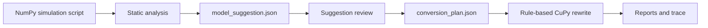

# SimForge GPU

[](pyproject.toml)
[](LICENSE)
[](docs/BACKEND_STRATEGY.md)
[](docs/MVP_SCOPE.md)

Local CPU-to-GPU migration harness for AI coding agents, focused on
correctness-first NumPy simulation migration to CuPy, with conversion plans,
validation reports, benchmark reports, and explicit unsupported-feature
handling.

`SimForge GPU` is the project name. The distribution package is
`simforge-gpu`, the Python import package is `simforge_gpu`, and the CLI command
is `simforge`.

```text
Model proposes. Harness constrains. Tools execute. Tests decide. Reports explain.
```

**Keywords:** NumPy, CuPy, GPU migration, Monte Carlo, statistical simulation,
validation, benchmark reports, AI coding agents, no-GPU CI, correctness-first.

[Demo walkthrough](docs/DEMO.md) · [MVP scope](docs/MVP_SCOPE.md) ·
[Architecture](docs/ARCHITECTURE.md) · [Validation](docs/VALIDATION_STRATEGY.md)
· [Testing](docs/TESTING_STRATEGY.md) · [Roadmap](docs/ROADMAP.md)

---

## Why SimForge GPU Exists

Many statistical simulations are naturally parallel: Monte Carlo estimates,
bootstrap resampling, permutation tests, random walks, and repeated sampling
experiments. These workloads can be good GPU candidates, but safe migration
requires more than replacing `np` with `cp`.

SimForge GPU makes the migration reviewable:

- analyze a single-file NumPy simulation script;
- decide whether the workload is a plausible GPU candidate;
- write a structured conversion plan before generating code;
- transform only a small, explicit MVP NumPy API subset;
- report unsupported code instead of silently skipping it;
- validate deterministic or stochastic outputs when possible;
- benchmark only when real execution is available;
- explain what changed, what failed, and what remains uncertain.
- optionally review an external agent's `model_suggestion.json` without trusting
  it as a transformation.

It is not a universal compiler or a model API wrapper. It is a conservative
local migration harness for small, auditable Python simulation scripts. External
agents can provide advice, but the harness validates that advice and keeps
`conversion_plan.json` as the accepted plan.

## What Makes It Different

| Approach | What happens | Risk |
| --- | --- | --- |
| Naive search-and-replace | `np` becomes `cp` everywhere | Unsafe code may look converted |
| Black-box LLM conversion | A model rewrites code directly | Unsupported behavior can be hidden |
| SimForge GPU deterministic path | Rules create a plan, transform supported regions, and produce reports | Slower to expand, but easier to audit |
| SimForge GPU model-assisted path | External model advice is reviewed, source-labeled, and selectively merged | Advice is useful, but never trusted alone |

The goal is not to claim speedup early. The goal is to make every conversion
explainable before it becomes executable.

## MVP Status

| Area | Status |
| --- | --- |
| Python NumPy simulation analysis | Implemented |
| NumPy to CuPy conversion | Implemented for an explicit MVP API subset |
| Real CuPy validation and benchmark | Implemented when CuPy/CUDA are available |
| no-GPU analysis, planning, reporting, and tests | Implemented |
| External model suggestion review | Implemented as local JSON artifact review |
| TorchBackend | Planned only, no fake torch code |
| JAX, Numba-CUDA, cuDF, R support | Roadmap only |

## Try It In 60 Seconds

```bash
python -m pip install -e .

simforge list-backends
simforge run-demo monte_carlo_pi
simforge report projects/monte_carlo_pi
```

In a no-GPU environment, validation and benchmark reports are marked `SKIPPED`
with reasons. In a CuPy/CUDA environment, the same workflow can execute the CPU
and generated CuPy scripts.

Optional GPU dependencies:

```bash
python -m pip install -e ".[gpu]"
```

## The Workflow


Every conversion starts with a plan. Unsupported features are recorded as
artifacts, not hidden as comments in generated code.

External model advice is optional:



`model_suggestion.json` is model opinion. `suggestion_review.json` is the
harness review of that opinion. `conversion_plan.json` is the harness-accepted
plan.

## Example

Input:

```python
import numpy as np

n = 100_000
x = np.random.uniform(size=n)
y = np.random.uniform(size=n)
inside = x * x + y * y <= 1.0
pi_estimate = 4.0 * np.mean(inside)
print(pi_estimate)
```

For the MVP CuPy target, SimForge GPU can generate a candidate such as:

```python
import cupy as cp

x = cp.random.uniform(size=n)
y = cp.random.uniform(size=n)
inside = x * x + y * y <= 1.0
pi_estimate = 4.0 * cp.mean(inside)
```

The generated project also includes a conversion plan, unsupported report,
validation report, benchmark report, syntax report, quality report, and
human-readable explanation.

## Generated Artifacts

For a project such as `projects/monte_carlo_pi/`, the workflow can write:

```text
generated/input_cpu_gpu.py
reports/analysis_ir.json
reports/conversion_plan.json
reports/unsupported_report.md
reports/explanation_report.md
reports/validation_report.md
reports/benchmark_report.md
reports/syntax_report.md
reports/quality_report.md
runs/validation.json
runs/benchmark.json
```

When a model suggestion is supplied, the workflow also writes:

```text
reports/model_suggestion.json
reports/suggestion_review.json
reports/suggestion_review.md
reports/agent_trace.json
```

These artifacts are meant for review by humans, CI, and AI coding agents.

## Supported MVP Scope

Supported code shape:

- single-file Python scripts;
- NumPy-based statistical simulations;
- simple independent trials and repeated sampling;
- scalar output validation;
- simple numeric JSON/list output validation;
- conservative NumPy API rewrites to CuPy.

First-batch examples:

- `monte_carlo_pi`
- `normal_mean_probability`
- `bootstrap_mean`
- `random_walk`
- `permutation_test`

See [docs/EXAMPLES.md](docs/EXAMPLES.md) for example-specific conversion
status.

## Explicitly Unsupported In The MVP

The MVP does not support:

- general R or Python to GPU compilation;
- real TorchBackend conversion;
- JAX, Numba-CUDA, or cuDF conversion;
- pandas-heavy pipelines;
- plotting conversion;
- file I/O as a GPU conversion target;
- network, database, multiprocessing, or multithreading conversion;
- class-heavy or dynamic `eval` / `exec` conversion;
- fake benchmark speedups or unvalidated performance claims.
- direct OpenAI or other model API calls from the `simforge` CLI.

Unsupported reports include stable categories such as
`backend_not_implemented`, `unsupported_numpy_api`, `pandas_pipeline`,
`plotting`, `file_io`, `dynamic_execution`, `side_effect_loop`, and
`sequential_dependency`.

Torch is intentionally rejected in the MVP:

```bash
simforge convert examples/monte_carlo_pi/input_cpu.py --target torch
```

That command writes an unsupported report and does not generate torch code.

## Benchmark Honesty

Benchmarking is intentionally cautious. A benchmark report may include CPU
runtime, GPU runtime, median/min/mean summaries, raw timing samples, and speedup
only after real execution.

Successful MVP benchmark reports are marked:

```text
measurement_method: subprocess_wall_time
trust_level: demo_only
```

That means timings include Python process startup and CUDA initialization
overhead, do not isolate host/device transfer time, and should not be treated as
general performance claims. Skipped benchmarks do not report speedup.

Efficiency work, larger workload comparisons, and richer in-process benchmark
measurement belong to the next phase.

## CLI Reference

| Command | Purpose |
| --- | --- |
| `simforge analyze input.py` | Write static analysis IR |
| `simforge convert input.py --target cupy` | Generate CuPy code and reports |
| `simforge convert input.py --target cupy --suggestion model_suggestion.json` | Review model advice, merge accepted advisory fields, then convert |
| `simforge convert input.py --target cupy --dry-run` | Plan only, no generated GPU file |
| `simforge convert input.py --target torch` | Planned-only rejection path |
| `simforge review-suggestion model_suggestion.json --source input.py` | Review model advice without generating code |
| `simforge validate original.py generated_gpu.py` | Validate CPU/GPU outputs or skip safely |
| `simforge benchmark original.py generated_gpu.py` | Benchmark CPU/GPU scripts or skip safely |
| `simforge explain conversion_plan.json` | Render a human-readable explanation |
| `simforge run-demo monte_carlo_pi` | Run an included end-to-end demo |
| `simforge report projects/monte_carlo_pi` | Print a concise project summary |
| `simforge demo-status` | Summarize generated demo projects |
| `simforge inspect-project projects/name` | Inspect artifacts and next steps |
| `simforge check-artifacts projects/name` | CI-friendly artifact completeness check |
| `simforge doctor` | Inspect local package and optional GPU status |
| `simforge list-backends` | Show backend status |
| `simforge list-patterns` | Show supported simulation patterns |

Machine-readable JSON is available for:

```bash
simforge list-backends --json
simforge list-patterns --json
simforge demo-status --json
simforge inspect-project projects/monte_carlo_pi --json
simforge check-artifacts projects/monte_carlo_pi --json
simforge doctor --json
```

## Validation

Validation is correctness-first:

- deterministic code should use shape, dtype, and numerical tolerance checks;
- stochastic simulation should use statistical tolerance, not elementwise random
  number equality;
- skipped validation is explicit and includes a reason;
- validation can write both Markdown and machine-readable JSON.

Useful options:

```bash
simforge validate original.py generated_gpu.py --tolerance 0.2
simforge validate original.py generated_gpu.py --repeat 3 --tolerance 0.2
```

The current GPU-capable MVP validates scalar outputs and simple numeric
JSON/list outputs.

## Tests

Recommended no-GPU CI command:

```bash
python -m pytest -m "not gpu" -q
```

Full local test suite:

```bash
python -m pytest -q
```

Optional GPU tests:

```bash
python -m pytest -m gpu -q
```

Use `SIMFORGE_DISABLE_GPU=1` to force validation and benchmark commands into
safe skipped-report mode.

## Documentation

- [Project brief](docs/PROJECT_BRIEF.md)
- [MVP scope](docs/MVP_SCOPE.md)
- [Architecture](docs/ARCHITECTURE.md)
- [Backend strategy](docs/BACKEND_STRATEGY.md)
- [Validation strategy](docs/VALIDATION_STRATEGY.md)
- [Testing strategy](docs/TESTING_STRATEGY.md)
- [Demo walkthrough](docs/DEMO.md)
- [Release checklist](docs/RELEASE_CHECKLIST.md)
- [Roadmap](docs/ROADMAP.md)

## Roadmap

Near-term:

- richer static analysis and memory suitability checks;
- broader validation beyond scalar and simple JSON/list outputs;
- in-process benchmark runner with transfer-overhead accounting;
- workload-size benchmark comparisons to find CPU/GPU crossover points.

Later:

- real TorchBackend design;
- R support;
- JAX;
- Numba-CUDA;
- cuDF;
- editor and agent workflow integrations.

## Contributing

Contributions should preserve the project boundary:

- no fake backend implementations;
- no silent unsupported behavior;
- no performance claims without validation and benchmark context;
- tests must not depend on a real LLM service;
- no-GPU tests should remain first-class.

## License

MIT License. See [LICENSE](LICENSE).
